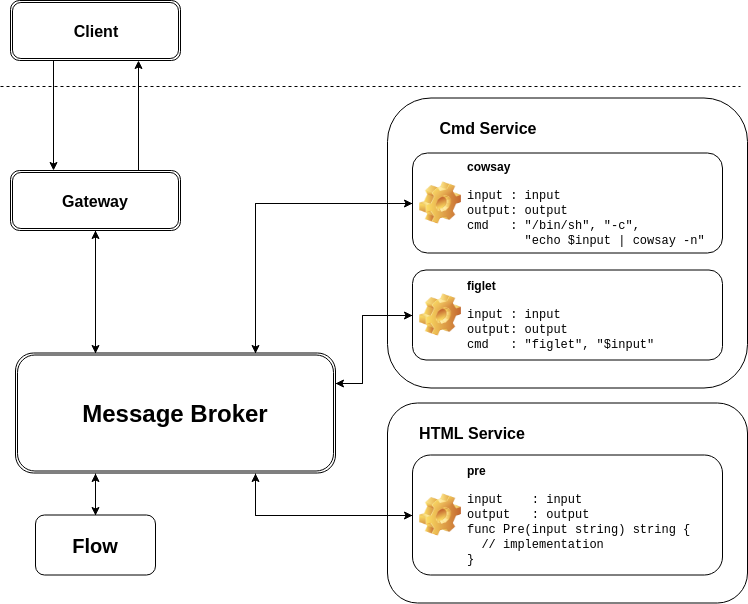
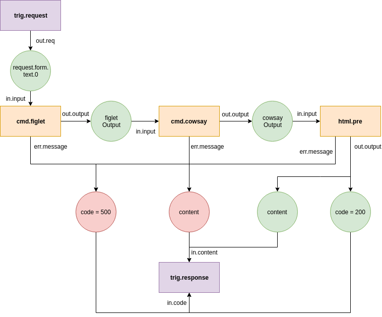

# Ayanami

A FaaS-like framework for your own infrastructure.

The name is inspired from `Evangelion-Unit-00's pilot`: `Ayanami Rei`. The name `Rei` itself has the same pronunciation as in Heraclitus's philosophy, `Panta Rhei` (lit: everything flows). We believe that the developer should focus more on data flows and transformations rather than managing infrastructures.


# Why

* FaaS is good since it let you focus on the code instead of infrastructure
* Any FaaS providers are prone to vendor lock-in
* Having your own infrastructure (e.g: kubernetes) while developing/deploying in FaaS manner is a good solution
* At some point, developers need to run the entire infrastructure in their local machine. In this case, installing kubernetes/minikube could be overkill
* Copy pasting several logics from single domain to another domain is probably inevitable, but prone to mistakes.

# Goal

Providing an environment with minimum dependencies in order to:

* Build & deploy FaaS
* Make kubernetes-ready artifacts
* Run the entire infrastructure locally without kubernetes

# Dependencies

* golang 1.2
* nats

# How

* Developer create functions. The functions can be written in any language, even binary
* Developer define flows (how the functions are connected to each others)
* Developer create templates if necessary
* Ayanami compose flows and functions into several microservices that can talk to each other using nats messaging.

# Getting started

```
ayanami init -p awesomeproject -r "github.com/gofrendi/awesomeproject"
```

# Terminologies

* `Source Code`: The source code you write, typically implementation of `functions`.
* `Composition`: Define the logic architecture of your program.
    - `Flow`: Your business logic. Basically, flow should receive `package` from the `trigger`, send the message to other `flows` or `services`, and finally send package to output `trigger`
    - `Trigger`: Trigger might send/receive a `package`. It is how you communicate with the outside world (e.g: HTTP request trigger, HTTP response trigger, scheduler, etc)
    - `Service`: Container of functions. If your functions are depending on each others or belong to the same domain, you should consider to put them into single service
    - `Function`: The most atomic process component.
    - `Package`: The message sent/received from `service`, `flow`, or `trigger`
* `Template`: The template to generate `deployable` based on your `source code` and `composition`
* `Deployable`: The generated source code of your program, final output of ayanami.

# Convention

## Event Name

Event Name should comply one of these formats

```
<ID>.<trig|srvc|flow>.<serviceName>.<segments...>.<out|in>.<varName>
<ID>.<trig|srvc|flow>.<serviceName>.<segments...>.err.message
```

* `<ID>` is 32 characters of `UUID v4 with no hyphens`.
* `<trig|srvc|flow>` is service type, either `trig` (trigger), `srvc` (service), or `flow`.
* `<serviceName>` is either serviceName or flowname. Should only contains alphanumeric.
* `<segments...>` is description of the event. Should only contains alphanumeric or `.`, but should not started, ended, or has two consecutive `.`.
* `<out|in>` is either `out` or `in`. Typically services consume `in` event and omit `out` event.
* `<varName>` is variable name.

__Note:__ We strip `hyphens` from UUID because Nats documentation said it only accept alpha numeric and dots as event name.

# Gateway

Whenever gateway receive HTTP request from the client, it will send message to `<ID>.trig.request.out.req` containing:

* `header`
* `contentLength`
* `host`
* `form`
* `postForm`
* `multipartForm`
* `method`
* `requestURI`
* `remoteAddr`
* `JSONBody`

Please refer to go's `net/http` documentation for more information about the message.

Once the message sent, gateway will listen to `<ID>.trig.response.<http-verb>.<url-segments>.in.code` and `<ID>.trig.response.<http-verb>.<url-segments>.in.message`. `Code` should contains HTTP response code, while `message` should contains HTTP Message.

It is flow's responsibility to

## Create Gateway

```go
package integrationtest

import (
	"github.com/state-alchemists/ayanami/config"
	"github.com/state-alchemists/ayanami/gateway"
	"github.com/state-alchemists/ayanami/msgbroker"
	"log"
)

// MainGateway emulating gateway's main
func MainGateway() {
	routes := []string{ // define your routes here
		"/",
	}
	broker, err := msgbroker.NewNats(config.GetNatsURL())
	if err != nil {
		log.Fatal(err)
	}
	port := config.GetGatewayPort()
	multipartFormLimit := config.GetGatewayMultipartFormLimit()
	gateway.Serve(broker, port, multipartFormLimit, routes)
}
```

# Service

Service listen message from input and send message to both, output, and error events:
* Input events: `<ID>.srvc.<serviceName>.<methodName>.in.<varName>`
* Output events: `<ID>.srvc.<serviceName>.<methodName>.out.<varName>`
* Error events: `<ID>.srvc.<serviceName>.<methodName>.err.message`

## Create Service (Go)

This is an example of service, written in golang:

```go
package integrationtest

import (
	"github.com/state-alchemists/ayanami/config"
	"github.com/state-alchemists/ayanami/msgbroker"
	"github.com/state-alchemists/ayanami/service"
	"log"
    "fmt"
)

// MainServiceHTML emulating HTML's main
func MainServiceHTML() {
	serviceName := "html"
	// define broker
	broker, err := msgbroker.NewNats(config.GetNatsURL())
	if err != nil {
		log.Fatal(err)
	}
	// define services
	services := service.Services{
		service.NewService(serviceName, "pre",
			[]string{"input"},
			[]string{"output"},
			WrappedPre,
		),
	}
	// consume and publish forever
	ch := make(chan bool)
	services.ConsumeAndPublish(broker, serviceName)
	<-ch
}

// Pre implemented by user
func Pre(text string) string {
	return fmt.Sprintf("<pre>%s</pre>", text)
}

// WrappedPre implemented by user
func WrappedPre(inputs service.Dictionary) (service.Dictionary, error) {
	outputs := make(service.Dictionary)
	inputText := inputs["input"].(string)
	outputText := Pre(inputText)
	outputs["output"] = outputText
	return outputs, nil
}
```

## Create Service (Cmd)

This is an example of Command line service.

```go
package integrationtest

import (
	"github.com/state-alchemists/ayanami/config"
	"github.com/state-alchemists/ayanami/msgbroker"
	"github.com/state-alchemists/ayanami/service"
	"log"
)

// MainServiceCmd emulating cmd's main function
func MainServiceCmd() {
	serviceName := "cmd"
	// define broker
	broker, err := msgbroker.NewNats(config.GetNatsURL())
	if err != nil {
		log.Fatal(err)
	}
	// define services
	services := service.Services{
		service.NewCmd(serviceName, "cowsay",
			[]string{"input"},
			[]string{"output"},
			[]string{"/bin/sh", "-c", "echo $input | cowsay -n"},
		),
		service.NewCmd(serviceName, "figlet",
			[]string{"input"},
			[]string{"output"},
			[]string{"figlet", "$input"},
		),
	}
	// consume and publish forever
	ch := make(chan bool)
	services.ConsumeAndPublish(broker, serviceName)
	<-ch
}
```

# Flow

Flow is your business logic. Let's say you have develop several services like in our previous examples. Your architecture should looks like this:



You can then create a flow to orchestrate the services:



## Create Flow

```go
package integrationtest

import (
	"github.com/state-alchemists/ayanami/config"
	"github.com/state-alchemists/ayanami/msgbroker"
	"github.com/state-alchemists/ayanami/service"
	"log"
)

// MainFlow emulating flow's main function
func MainFlow() {
	// define broker
	broker, err := msgbroker.NewNats(config.GetNatsURL())
	if err != nil {
		log.Fatal(err)
	}
	// define services
	services := service.Services{
		service.NewFlow("main", broker,
			// inputs
			[]string{"request"},
			// outputs
			[]string{"content", "code"},
			[]service.FlowEvent{
				service.FlowEvent{
					InputEvent: "trig.request.get.out.req",
					VarName:    "request",
				},
				service.FlowEvent{
					VarName:     "request.form.text.0",
					OutputEvent: "srvc.cmd.figlet.in.input",
				},
				service.FlowEvent{
					InputEvent:  "srvc.cmd.figlet.out.output",
					VarName:     "figletOutput",
					OutputEvent: "srvc.cmd.cowsay.in.input",
				},
				service.FlowEvent{
					InputEvent:  "srvc.cmd.cowsay.out.output",
					VarName:     "cowsayOutput",
					OutputEvent: "srvc.html.pre.in.input",
				},
				// normal response
				service.FlowEvent{
					InputEvent:  "srvc.html.pre.out.output",
					VarName:     "content",
					OutputEvent: "trig.response.get.in.content",
				},
				service.FlowEvent{
					InputEvent:  "srvc.html.pre.out.output",
					VarName:     "code",
					UseValue:    true,
					Value:       200,
					OutputEvent: "trig.response.get.in.code",
				},
				// error response from figlet
				service.FlowEvent{
					InputEvent: "srvc.cmd.figlet.err.message",
					VarName:    "code",
					UseValue:   true,
					Value:      500,
				},
				service.FlowEvent{
					InputEvent: "srvc.cmd.figlet.err.message",
					VarName:    "content",
				},
				// error response from cowsay
				service.FlowEvent{
					InputEvent: "srvc.cmd.cowsay.err.message",
					VarName:    "code",
					UseValue:   true,
					Value:      500,
				},
				service.FlowEvent{
					InputEvent: "srvc.cmd.cowsay.err.message",
					VarName:    "content",
				},
				// error response from pre
				service.FlowEvent{
					InputEvent: "srvc.html.pre.err.message",
					VarName:    "code",
					UseValue:   true,
					Value:      500,
				},
				service.FlowEvent{
					InputEvent: "srvc.html.pre.err.message",
					VarName:    "content",
				},
			},
		),
	}
	// consume and publish forever
	ch := make(chan bool)
	services.ConsumeAndPublish(broker, "flow")
	<-ch
}
```
