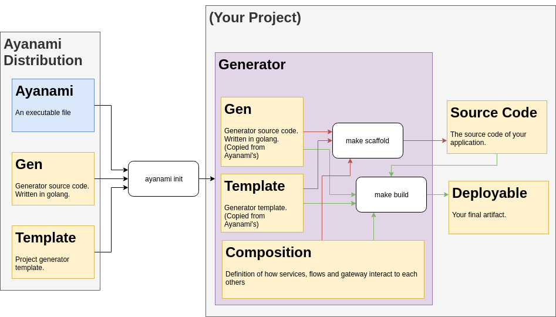
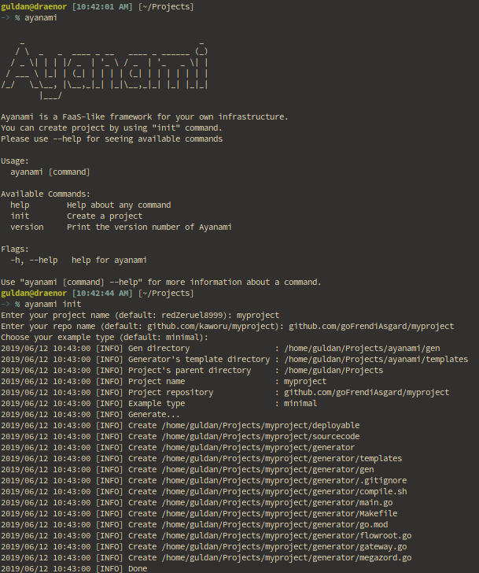
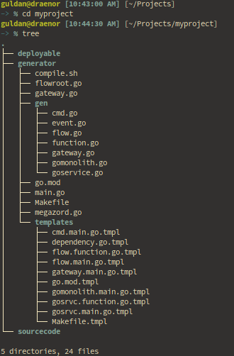
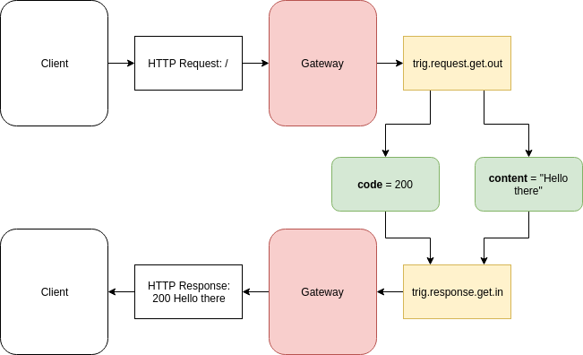
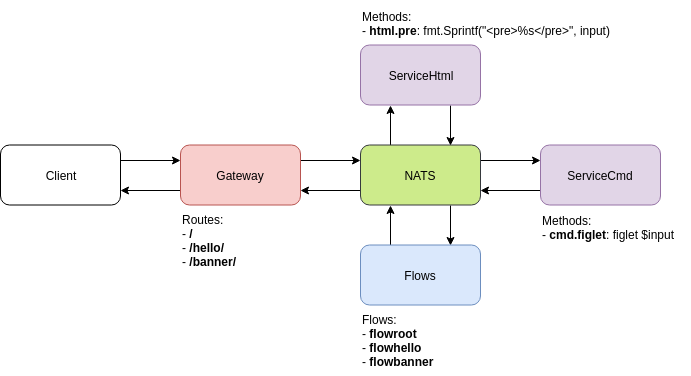

# Ayanami

A FaaS-like framework for your own infrastructure.

The name is inspired from `Evangelion-Unit-00's pilot`: `Ayanami Rei`. The name `Rei` itself has the same pronunciation as in Heraclitus's philosophy, `Panta Rhei` (lit: everything flows). We believe that the developer should focus more on data flows and transformations rather than managing infrastructures.


# Why

* FaaS is good since it let you focus on the code instead of infrastructure
* Any FaaS providers are prone to vendor lock-in
* Having your own infrastructure (e.g: kubernetes) while developing/deploying in FaaS manner is a good solution
* At some point, developers need to run the entire infrastructure in their local machine. In this case, installing kubernetes/minikube could be overkill
* Copy pasting several logics from single domain to another domain is probably inevitable, but prone to mistakes.

# Goal

Providing an environment with minimum dependencies in order to:

* Build & deploy microservices/monolithic
* Make kubernetes-ready artifacts
* Run the entire infrastructure locally without kubernetes (either as microservices or as single monolithic)

# Dependencies

* golang 1.2
* nats

# How



1. User creating a project by invoking `ayanami init`.
2. User write `composition` inside project's generator.
3. Once the composition has been defined, user invoke `make scaffold` to generate `source code`.
4. User completing the generated `source code`.
5. User deploying the application by invoking `make build`
6. Whenever the `composition` has to be modified, user need to to re-`scaffold` and re-`build`. Please note that the generator will never overwrite the `source code`.
7. User can modify or write their his/her own `template` or `gen`.

# Terminologies

* `Composition`: Data flow and architecture of your program. Composition contains `flows`, `services`.
* `Flow`: Your business logic. Basically, flow should receive `package` from input `trigger`, send the message to other `flows` or `services`, and finally send package to output `trigger`.
* `Trigger`: Trigger might send/receive a `package`. It is how you communicate with the outside world (e.g: HTTP request trigger, HTTP response trigger, scheduler, etc)
* `Service`: Container of `functions`. If your functions are depending on each others or belong to the same domain, you should consider to put them into single service
* `Function`: The most atomic process component. Several `functions` might belong into a single `service`.
* `Package`: The message sent/received from `service`, `flow`, or `trigger`.
* `Gen`: The algorithm to generate `deployable` based on your `source code` and `composition`.
* `Template`: The template to generate `deployable` based on your `source code` and `composition`.
* `Deployable`: The generated source code of your program, final output of ayanami. Generated during `build` process.
* `Source Code`: The source code you write, typically implementation of `functions`. Generated during `scaffold` process.
* `Scaffold`: The process to create `source code` prototype based on `composition` and `template`.
* `Build`: The process to create `deployable` based on `composition`, `source code` and `template`.
* `Event Name`: Event names use by message broker see the convention section.

## Event Name Convention

Event Name should comply one of these formats

```
<ID>.<trig|srvc|flow>.<serviceName>.<segments...>.<out|in>.<varName>
<ID>.<trig|srvc|flow>.<serviceName>.<segments...>.err.message
```

* `<ID>` is 32 characters of `UUID v4 with no hyphens`.
* `<trig|srvc|flow>` is service type, either `trig` (trigger), `srvc` (service), or `flow`.
* `<serviceName>` is either serviceName or flowname. Should only contains alphanumeric.
* `<segments...>` is description of the event. Should only contains alphanumeric or `.`, but should not started, ended, or has two consecutive `.`.
* `<out|in>` is either `out` or `in`. Typically services consume `in` event and omit `out` event.
* `<varName>` is variable name.

__NOTE:__ We strip `hyphens` from UUID because Nats documentation said it only accept alpha numeric and dots as event name.

# Getting started

## Prerequisite

To follow this tutorial you should have `git`, `go 1.12`, and `nats`. Using docker is recommended but not required.

## Clone Ayanami

First of all, you have to clone ayanami's repository by performing `git clone git@github.com:state-alchemists/ayanami.git`. This will make a directory named `ayanami`.

After you have ayanami cloned to your local computer, you should build the executable by performing `make build` or `go build`.

For convenience, you can temporarily add alias to ayanami executable, so that you can run the executable from everywhere. To do so, just type `alias="<ayanami-directory-location>/ayanami"`. To make this permanent, you can add the same command to your `.bashrc` or `.zshrc`.

## Create Project

To create a project, you should invoke `ayanami init`. Ayanami will ask for project name, project repository, and example type. For example type, currently there are two options available, `full` and `minimal`. For now, let's choose `minimal`.



## Exploring The Project



The `minimal` example has a composition containing a gateway and a flow. Currently our gateway only serve `/` request:

```go
package main

// location: generator/gateway.go

import (
	"github.com/goFrendiAsgard/myproject/gen"
)

func init() {

	// define gateway
	gateway := gen.NewEmptyGateway(&Gen,
		"gateway",                 // service name
		"github.com/nerv/gateway", // repo name
	)

	// add routes to gateway
	gateway.AddRoute("/")

	// register gateway
	Gen.AddConfig(gateway)

}
```

Gateway is a bridge between your `services` and outside world. Whenever a gateway receive HTTP request from client, it will emit a `request out` and subscribe to `response in` events.

The event published by a gateway are: `<ID>.trig.request.<method><Dotted-URL>.out`, `<ID>.trig.request.<method><Dotted-URL>.out.<variable>`.

`<method>` is either `get`, `post`, `put`, `delete`, or `*`. While `<Dotted-URL>` is your route with every `/` replaced with `.`. Finally, `<variable>` is one of these values:

* method
* URL
* proto
* protoMajor
* protoMinor
* header
* contentLength
* transferEncoding
* host
* form
* postForm
* multipartForm
* trailer
* remoteAddr
* requestURI
* cookies
* userAgent

While publishing request out events, gateway will also listen to to `response in` event. This event has the following name: `<ID>.trig.response.<method><Dotted-URL>.in`.

That's all you need to know about gateway. Now let's move to `flow`.

Flow define how your gateway and services are interacting to each other.

```go
package main

// location: generator/flowroot.go

import (
	"github.com/goFrendiAsgard/myproject/gen"
)

func init() {

	// define flow
	flow := gen.NewEmptyFlow(&Gen,
		"github.com/goFrendiAsgard/flowroot", // repo name
		"root",                               // flow name
		[]string{"content", "code"},          // inputs
		[]string{"content", "code"},          // outputs
	)

	// get http request from "/" and send 200 as http response's code
	flow.AppendEvent(gen.Event{
		InputEventName:  "trig.request.get.out",
		UseValue:        true,
		Value:           200,
		VarName:         "code",
		OutputEventName: "trig.response.get.in.code",
	})

	// get http request from "/" and send "Hello there" as http response's content
	flow.AppendEvent(gen.Event{
		InputEventName:  "trig.request.get.out",
		UseValue:        true,
		Value:           "Hello there",
		VarName:         "content",
		OutputEventName: "trig.response.get.in.content",
	})

	// register flow
	Gen.AddConfig(flow)

}
```

This flow is quite simple:
* The flow started when it receive `content` and `code` from `trig.request.get.out`.
* Once the flow receives the message, it will set `code` into 200 and `content` into `Hello there`. 
* Finally it will send the `code` and `content` into `trig.response.get.in.code` and `trig.response.get.in.content` respectively.

A flow should be started when it got all `inputs`, and it should be ended when all `outputs` are set. For a better ilustration, please see the following diagram:



## Create Custom Composition

Aside from the existing gateway that always give us `200 Hello there` for every request, we want to add two serve some other endpoints.

* `/hello/:name`: We want this one to give response based on URL parameter. For example `/hello/shinji` should give us `200 Hello shinji`
* `/banner/`: We want this one to give us a large ascii banner by utilizing [figlet](http://www.figlet.org/). For example, `/banner/hi` should give us:

```
 _     _ 
| |__ (_)
| '_ \| |
| | | | |
|_| |_|_|
```

Please be aware that since we want to serve `/banner/` using HTTP protocol, and client will likely use web browser to access it, we also need to add a `<pre></pre>` tag.

Let's plan how everything is going to work.

First, we probably need two services. One to deal with HTML, and another one that deal with Cmd. Next, we need to add two routes into the gateway, and define several flows. Roughly, it our architecture should looks like this:


