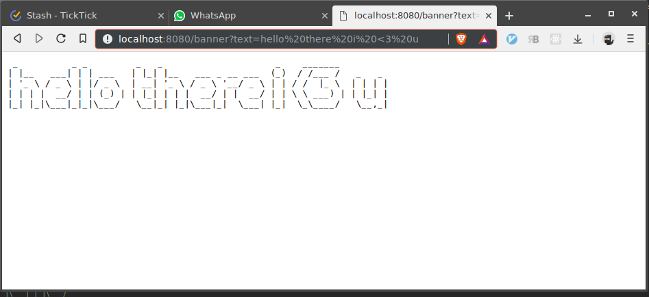

# Ayanami

A FaaS-like framework for your own infrastructure.

The name is inspired from `Evangelion-Unit-00's pilot`: `Ayanami Rei`. The name `Rei` itself has the same pronunciation as in Heraclitus's philosophy, `Panta Rhei` (lit: everything flows). We believe that the developer should focus more on data flows and transformations rather than managing infrastructures.


# Why

* FaaS is good since it let you focus on the code instead of infrastructure
* Any FaaS providers are prone to vendor lock-in
* Having your own infrastructure (e.g: kubernetes) while developing/deploying in FaaS manner is a good solution
* At some point, developers need to run the entire infrastructure in their local machine. In this case, installing kubernetes/minikube could be overkill
* Copy pasting several logics from single domain to another domain is probably inevitable, but prone to mistakes.

# Goal

Providing an environment with minimum dependencies in order to:

* Build & deploy microservices/monolithic
* Make kubernetes-ready artifacts
* Run the entire infrastructure locally without kubernetes (either as microservices or as single monolithic)

# Dependencies

* golang 1.2
* nats

# How

* User define `composition` and `templates` (what services are available, and how do they interact to each other, how everything should be generated)
* User scaffold the `source code`
* User edit the `source code` to match their need
* User build a `deployable`
* Done :)

```
Nothing                             --> [init]     --> composition + template
composition + template              --> [scaffold] --> sourceCode
composition + sourceCode + template --> [build]    --> deployable
```

# Terminologies

* `Composition`: Data flow and architecture of your program. Composition contains `flows`, `services`.
* `Flow`: Your business logic. Basically, flow should receive `package` from input `trigger`, send the message to other `flows` or `services`, and finally send package to output `trigger`.
* `Trigger`: Trigger might send/receive a `package`. It is how you communicate with the outside world (e.g: HTTP request trigger, HTTP response trigger, scheduler, etc)
* `Service`: Container of `functions`. If your functions are depending on each others or belong to the same domain, you should consider to put them into single service
* `Function`: The most atomic process component. Several `functions` might belong into a single `service`.
* `Package`: The message sent/received from `service`, `flow`, or `trigger`.
* `Template`: The template to generate `deployable` based on your `source code` and `composition`.
* `Deployable`: The generated source code of your program, final output of ayanami. Generated during `build` process.
* `Source Code`: The source code you write, typically implementation of `functions`. Generated during `scaffold` process.
* `Scaffold`: The process to create `source code` prototype based on `composition` and `template`.
* `Build`: The process to create `deployable` based on `composition`, `source code` and `template`.
* `Event Name`: Event names use by message broker see the convention section.

## Event Name Convention

Event Name should comply one of these formats

```
<ID>.<trig|srvc|flow>.<serviceName>.<segments...>.<out|in>.<varName>
<ID>.<trig|srvc|flow>.<serviceName>.<segments...>.err.message
```

* `<ID>` is 32 characters of `UUID v4 with no hyphens`.
* `<trig|srvc|flow>` is service type, either `trig` (trigger), `srvc` (service), or `flow`.
* `<serviceName>` is either serviceName or flowname. Should only contains alphanumeric.
* `<segments...>` is description of the event. Should only contains alphanumeric or `.`, but should not started, ended, or has two consecutive `.`.
* `<out|in>` is either `out` or `in`. Typically services consume `in` event and omit `out` event.
* `<varName>` is variable name.

__NOTE:__ We strip `hyphens` from UUID because Nats documentation said it only accept alpha numeric and dots as event name.

# Getting started

## Prerequisite

To follow this tutorial you should have `git`, `go 1.12`, and `nats`. Using docker is recommended but not required.

## Clone Ayanami

First of all, you have to clone ayanami's repository by performing `git clone git@github.com:state-alchemists/ayanami.git`. This will make a directory named `ayanami`.

After you have ayanami cloned to your local computer, you should build the executable by performing `make build` or `go build`.

For convenience, you can temporarily add alias to ayanami executable, so that you can run the executable from everywhere. To do so, just type `alias="<ayanami-directory-location>/ayanami"`. To make this permanent, you can add the same command to your `.bashrc` or `.zshrc`.

## Create Project

To create project you can invoke `ayanami init`. In the following example, we want to create a project named `awesomeProject` which has a repo name `github.com/goFrendiAsgard/awesomeProject`. Feel free to set your own project/repo name. You can also press enter to let ayanami generate random project/repo name.

```bash
-> % ayanami init
Enter your project name (default: yellowZeruel9459): awesomeProject
Enter your repo name (default: github.com/toji/awesomeProject): github.com/goFrendiAsgard/awesomeProject
```

## Project Anatomy and Composition

Once the command has been executed, you will see some logs showing that several files has been created. Once it is done, you can move to your project directory and seeing around.

```bash
-> % cd awesomeProject
-> % tree
.
├── deployable
├── generator
│   ├── flowbanner.go
│   ├── flowroot.go
│   ├── gateway.go
│   ├── go.mod
│   ├── main.go
│   ├── megazord.go
│   ├── servicecmd.go
│   ├── servicehtml.go
│   ├── gen
│   │   ├── cmd.go
│   │   ├── event.go
│   │   ├── flow.go
│   │   ├── function.go
│   │   ├── gateway.go
│   │   ├── gomonolith.go
│   │   └── goservice.go
│   └── templates
│       ├── cmd.main.go.tmpl
│       ├── dependency.go.tmpl
│       ├── flow.function.go.tmpl
│       ├── flow.main.go.tmpl
│       ├── gateway.main.go.tmpl
│       ├── go.mod.tmpl
│       ├── gomonolith.main.go.tmpl
│       ├── gosrvc.function.go.tmpl
│       └── gosrvc.main.go.tmpl
└── sourcecode
```

The project is already stuffed with several examples. Let's have a look into it:
* `deployable`: All deployed artifact will be placed in this directory. All code here are generated and not supposed to be edited. If you want to change anything, please take a look at `generator/gen`, `generator/templates` or `sourcecode`
* `generator`: Almost all you need is located in this directory. Here, you will find `main.go`, `gen`, `templates`, and several `composition` example.
* `sourcecode`: Sometime composition need external source code written by users. This is where you will find them. After defining compoisitions, most of your time should be spent here. Writing source codes and unittest.

Let's start with our compositions:

### Gateway

Gateway is the bridge that connecting your internal services with outside world. As you create a project, a gateway definition example is created at `generator/gateway.go`. You can create as many gateway as possible, but usually you will only have a single gateway for your entire services.

Beside `service name` and `repo name`, a gateway definition should also contains `routes`. Beware that every `route` should be started and ended with `/`.

```go
package main

import (
    "github.com/whoever/whatever/gen"
)

func init() {

    // define gateway
    gateway := gen.NewEmptyGateway(&Gen,
        "gateway",                 // service name
        "github.com/nerv/gateway", // repo name
    )

    // add routes to gateway
    gateway.AddRoute("/")
    gateway.AddRoute("/banner/")

    // register gateway
    Gen.AddConfig(gateway)

}
```

### Service

One good way to make your code re-usable is by creating functions. Service is a collection of functions. In our example we have two service definitions:

#### HTML Service

It is a simple service containing a single method named `pre`. The service name is `html` and it's repo name is `github.com/nerv/servicehtml`. The definition is located at `generator/servicehtml.go`.

`html.pre` is a `go` function. It takes single input parameter and returns an output. This function has no dependencies.

The generator will create `html.pre` skeleton once you invoke `scaffold` command.

```go
package main

import (
    "github.com/whoever/whatever/gen"
)

func init() {

    // define service
    service := gen.NewEmptyGoService(&Gen,
        "html",                        // service name
        "github.com/nerv/servicehtml", // repo name
    )

    // add html.pre
    service.Set("pre", gen.NewFunction("html", "pre", 
        []string{"input"},  // inputs
        []string{"output"}, // outputs
        []string{},         // dependencies
    ))

    // register service
    Gen.AddConfig(service)

}
```

### CMD Service

Along with `html` service, we have another service named `cmd`. You can find it's definition at `generator/servicecmd.go`.

This type of service is pretty powerful since you can run any shell command here. Our service has a single method named `figlet` which basically run `figlet ${input}`. Cmd service can only has a single output named `output`, so you don't need to define it.

__NOTE:__ If you never heard about figlet, it is a funny command line tool to make larger text out of ordinary text. You can get figlet executable [here](http://www.figlet.org/) or you can install it by using either `apt`, `pacman` or `brew`.

```go
package main

import (
    "github.com/whoever/whatever/gen"
)

func init() {

    // define service
    service := gen.NewEmptyCmd(&Gen,
        "cmd",                        // service name
        "github.com/nerv/servicecmd", // repo name
    )

    // add command
    service.Set("figlet", "figlet $input")

    // register service
    Gen.AddConfig(service)

}
```

### Flow

So, we already have gateway and services definition. But without interacting to each other, your services and gateway are pretty useless.

Flow defines how your services and gateway are interacting to each other through message broker. In our example we have two services:

#### Root Flow

You can find root flow definition in `generator/flowroot.go`. This flow is pretty simple. 

Basically, whenever we receive `get /`, the gateway will send `trig.request.get.out` to the message broker.

Once we got the message, we will set `code` to `200`, and we will pass `request` to `html.CreateDefaultREsponse` function. The return value of the function will be stored as `content`.

Finally, `code` and `content` will be published to `trig.response.get.in.code` and `trig.response.get.in.content` respectively. Please see the comments for more detail explanation.

Please note that The generator will create `html.CreateDefaultResponse` skeleton once you invoke `scaffold` command.

```go
package main

import (
    "github.com/whoever/whatever/gen"
)

func init() {

    // define flow
    flow := gen.NewEmptyFlow(&Gen,
        "github.com/nerv/flowroot",  // repo name
        "root",                      // flow name
        []string{"content", "code"}, // inputs
        []string{"content", "code"}, // outputs
    )

    flow.AddEventVal(
        "trig.request.get.out",      // whenever get `request.get.out`
        "trig.response.get.in.code", // publish to `respose.get.in.code`
        "code",                      // the published variable name is `code`
        200,                         // and it's value is 200
    )

    flow.AddEventFunc(
        "trig.request.get.out",         // whenever get `request.get.out`
        "trig.response.get.in.content", // publish to `response.get.in.content`
        "content",                      // the published variable name is `content`, and we get it's value by running a function
        "html",                         // function's package is `html`
        "CreateDefaultResponse",        // function's name is `CreateDefaultResponse`
        []string{},                     // and the function has no dependency to other source code
    )

    // register flow
    Gen.AddConfig(flow)
    
}
```

#### Banner Flow

Banner flow is slightly more complicated since we deal with real services here (`CMD Service` and `HTML Service`).

The normal scenario (if everything run as intended), we will handle this `/banner?text=something` request, pass the text into `cmd.figlet.in.input`, and pass it's output (`cmd.figlet.out.output`) to `srvc.html.pre.in.input`. Finally, we set response's code and content so that the gateway can response appropriately.

However, since we are dealing with microservices, things might happened in the middle of communication. So, whenever we get `cmd.figlet.err.message` or `html.pre.err.message`, we want to give `500 internal server error` to client.

```go
package main

import (
    "github.com/whoever/whatever/gen"
)

func init() {

    // define flow
    flow := gen.NewEmptyFlow(&Gen,
        "github.com/nerv/flowbanner", // repo name
        "banner",                     // flow name
        []string{"request"},          // inputs
        []string{"content", "code"},  // outputs
    )

    flow.AddInputEvent(
        "trig.request.get.banner.out", // whenever get `request.get.banner.out`
        "request",                     // store it into a variable named `request`
    )

    flow.AddOutputEvent(
        "srvc.cmd.figlet.in.input", // publish to `srvc.cmd.figlet.in.input`
        "request.form.text.0",      // if `request.form.text.0` is set
    )

    flow.AddEvent(
        "srvc.cmd.figlet.out.output", // whenever get `srvc.cmd.figlet.out.output`
        "srvc.html.pre.in.input",     // publish to `srvc.html.pre.in.input`
        "figletOut",                  // the published variable name `figletOut`
    )

    flow.AddEvent(
        "srvc.html.pre.out.output",            // whenever get `srvc.html.pre.out.output`
        "trig.response.get.banner.in.content", // publish to `trig.response.get.banner.in.content`
        "content",                             // the published variable name is `content`
    )

    // the rest of this are error handlers

    flow.AddEventVal(
        "srvc.html.pre.out.output",
        "trig.response.get.banner.in.code",
        "code",
        200,
    )

    flow.AddEvent(
        "srvc.cmd.figlet.err.message",
        "trig.response.get.banner.in.content",
        "content",
    )

    flow.AddEventVal(
        "srvc.cmd.figlet.err.message",
        "trig.response.get.banner.in.code",
        "code",
        500,
    )

    flow.AddEvent(
        "srvc.html.pre.err.message",
        "trig.response.get.banner.in.content",
        "content",
    )

    flow.AddEventVal(
        "srvc.html.pre.err.message",
        "trig.response.get.banner.in.code",
        "code",
        500,
    )

    // register flow
    Gen.AddConfig(flow)
}
```

## Scaffolding

Having our `compositions` prepared, we can continue with scaffolding. Scaffolding is a process to create source code skeleton. To scaffold source codes, first we have to move to `/generator` directory, performing build, and run the executable.

```bash
-> % cd generator
-> % go build && ./awesomeProject scaffold
```

After waiting for a while (it supposed to be less than a second), you will see that the generator has already make two files for you:

```bash
-> % tree ../sourcecode/
../sourcecode/
└── html
    ├── createdefaultresponse.go
    └── pre.go

1 directory, 2 files
```

Now, let's start to code. For `createdefaultresponse.go`, you can assign `"Hello there !!!"` as `newValue`.

```go
package html

// CreateDefaultResponse declaration
func CreateDefaultResponse(oldValue interface{}) interface{} {
    var newValue interface{}
    newValue = "Hello there !!!"
    return newValue
}
```

For `pre.go` you need to do more modifications. First you should import `fmt`, change the implementation of `pre`, and make sure that it takes and return `string` instead of `interface{}`.

```go
package html

import (
    "fmt"
    "github.com/state-alchemists/ayanami/service"
)

// pre declaration
func pre(input string) string {
    return fmt.Sprintf("<pre>%s</pre>", input)
}

// Wrappedpre wrapper for pre
func Wrappedpre(inputs service.Dictionary) (service.Dictionary, error) {
    Result := make(service.Dictionary)
    input := inputs.Get("input").(string)
    output := pre(input)
    Result.Set("output", output)
    return Result, nil
}
```

Now we are set. Let's build everything.

## Building

Having our composition and source code ready, now we can start creating deployables for our application.

```bash
-> % cd generator
-> % go build && ./awesomeProject build
```

Done. Now you have everything you need:

```bash
-> % tree ../deployable                              
../deployable
├── flow-banner
│   ├── go.mod
│   └── main.go
├── flow-root
│   ├── go.mod
│   ├── html
│   │   └── createdefaultresponse.go
│   └── main.go
├── gateway
│   ├── go.mod
│   └── main.go
├── megazord
│   ├── flowbanner.go
│   ├── flowroot.go
│   ├── gatewaygateway.go
│   ├── go.mod
│   ├── go.sum
│   ├── html
│   │   ├── createdefaultresponse.go
│   │   └── pre.go
│   ├── main.go
│   ├── megazord
│   ├── servicecmd.go
│   └── servicehtml.go
├── srvc-cmd
│   ├── go.mod
│   └── main.go
└── srvc-html
    ├── go.mod
    ├── html
    │   └── pre.go
    └── main.go
```

Before running your applications, please make sure you have already have `Nats` running.

### Run as Microservices

You can build and run `flow-banner`, `flow-root`, `gateway`, `srvc-cmd`, and `srvc-html` if you choose to run the application as microservices. In this case, you might need to open several terminal or use `tmux`.

```
# run flow-banner
cd ../deployable/flow-banner && go build && ./flowbanner

# run flow-root
cd ../deployable/flow-root && go build && ./flowroot

# run gateway
cd ../deployable/gateway && go build && ./gateway

# run srvc-cmd
cd ../deployable/srvc-cmd && go build && ./srvccmd

# run srvc-html
cd ../deployable/srvc-html && go build && ./srvchtml
```

Try to send request to `http://localhost:8080/` or `http://localhost:8080/banner?text=hello`

By modifying the `gen` and `template` in your `generator` folder, you can instantly change the behavior of the generated code (creating kubernetes manifest for example)

### Run as Monolithic

You can also choose to run your microservices as a single monolithic application. This is a perfect solution for on premise, stand-alone, or demo purpose. Let's try this out:

```bash
-> % cd ../deployable/megazord
-> % go build && ./megazord
2019/06/10 17:29:05 [INFO: flow.root] Consume from `*.flow.root.in.content`
2019/06/10 17:29:05 [INFO: flow.root] Consume from `*.trig.request.get.out`
2019/06/10 17:29:05 [INFO: flow.root] Consume from `*.flow.root.in.code`
2019/06/10 17:29:05 [INFO: flow.banner] Consume from `*.flow.banner.in.request`
2019/06/10 17:29:05 [INFO: flow.banner] Consume from `*.trig.request.get.banner.out`
2019/06/10 17:29:05 [INFO: Gateway] Routes `[]string{"/banner", "/"}`
2019/06/10 17:29:05 [INFO: cmd.figlet] Consume from `*.srvc.cmd.figlet.in.input`
2019/06/10 17:29:05 Listening on 8080
2019/06/10 17:29:05 [INFO: html.pre] Consume from `*.srvc.html.pre.in.input`
```

Now, you can shoot several request to our megazord:

```
-> % curl http://localhost:8080                    
Hello there !!!%
-> % curl http://localhost:8080/banner\?text\=hello
<pre> _          _ _       
| |__   ___| | | ___  
| '_ \ / _ \ | |/ _ \ 
| | | |  __/ | | (_) |
|_| |_|\___|_|_|\___/ 
                      
</pre>%
```

Finally, you can give your browser a shoot:


# For Developer

## Makefile

A makefile is available to help you while developing `Ayanami`. The possible commands are as following:

* `make test`: Test integration & unittest and create profile.out. Make sure you already has `nats` running before execute this command.
* `make testv`: Same as `make test`, but verbose.
* `make coverage`: Get code coverage as HTML.
* `make build`: Build ayanami for mac, windows, and linux. For each platform, there will be 2 executables (for i386 and amd64)
* `make cleantestgen`: Clear `.test-gen/whatever/` but let `.test-gen/whatever/sourcecode/` intact.
* `make testgen`: Emulate `init`, `scaffold`, and `build`. Since there is no easy way to test generated project, it is strongly recommend to check out the content of `.test-gen`. This command just make sure that at least our `templates` and `gen` doesn't yield runtime error and run `megazord`

## Distribution

To distribute `Ayanami`, you should copy at least one of our executable, along with `templates` and `gen` directory. When installed, the directories should be in the same location with the executable.

# Gateway (Tech Spec)

Whenever gateway receive HTTP request from the client, it will send `package` to `<ID>.trig.request.out` containing:

* method
* URL
* proto
* protoMajor
* protoMinor
* header
* contentLength
* transferEncoding
* host
* form
* postForm
* multipartForm
* trailer
* remoteAddr
* requestURI
* cookies
* userAgent

Please refer to go's `net/http` documentation for more information about it.

Once the request `package` sent, gateway will listen to `<ID>.trig.response.<http-verb>.<url-segments>.in.code` and `<ID>.trig.response.<http-verb>.<url-segments>.in.content`. `Code` should contains HTTP response code, while `content` should contains HTTP Message.

## Create Gateway

```go
package integrationtest

import (
    "github.com/state-alchemists/ayanami/config"
    "github.com/state-alchemists/ayanami/gateway"
    "github.com/state-alchemists/ayanami/msgbroker"
    "log"
)

// MainGateway emulating gateway's main
func MainGateway() {
    routes := []string{ // define your routes here
        "/",
    }
    broker, err := msgbroker.NewNats(config.GetNatsURL())
    if err != nil {
        log.Fatal(err)
    }
    port := config.GetGatewayPort()
    multipartFormLimit := config.GetGatewayMultipartFormLimit()
    gateway.Serve(broker, port, multipartFormLimit, routes)
}
```

# Service (Tech Spec)

Service listen message from input and send message to both, output, and error events:
* Input events: `<ID>.srvc.<serviceName>.<methodName>.in.<varName>`
* Output events: `<ID>.srvc.<serviceName>.<methodName>.out.<varName>`
* Error events: `<ID>.srvc.<serviceName>.<methodName>.err.message`

## Create Service (Go)

This is an example of service, written in golang:

```go
package integrationtest

import (
    "github.com/state-alchemists/ayanami/config"
    "github.com/state-alchemists/ayanami/msgbroker"
    "github.com/state-alchemists/ayanami/service"
    "log"
    "fmt"
)

// MainServiceHTML emulating HTML's main
func MainServiceHTML() {
    serviceName := "html"
    // define broker
    broker, err := msgbroker.NewNats(config.GetNatsURL())
    if err != nil {
        log.Fatal(err)
    }
    // define services
    services := service.Services{
        service.NewService(serviceName, "pre",
            []string{"input"},
            []string{"output"},
            WrappedPre,
        ),
    }
    // consume and publish forever
    ch := make(chan bool)
    services.ConsumeAndPublish(broker, serviceName)
    <-ch
}

// Pre implemented by user
func Pre(text string) string {
    return fmt.Sprintf("<pre>%s</pre>", text)
}

// WrappedPre implemented by user
func WrappedPre(inputs service.Dictionary) (service.Dictionary, error) {
    outputs := make(service.Dictionary)
    inputText := inputs.Get("inputs").(string)
    outputText := Pre(inputText)
    outputs.Set("output", outputText)
    return outputs, nil
}
```

## Create Service (Cmd)

This is an example of Command line service.

```go
package integrationtest

import (
    "github.com/state-alchemists/ayanami/config"
    "github.com/state-alchemists/ayanami/msgbroker"
    "github.com/state-alchemists/ayanami/service"
    "log"
)

// MainServiceCmd emulating cmd's main function
func MainServiceCmd() {
    serviceName := "cmd"
    // define broker
    broker, err := msgbroker.NewNats(config.GetNatsURL())
    if err != nil {
        log.Fatal(err)
    }
    // define services
    services := service.Services{
        service.NewCmd(serviceName, "cowsay",
            []string{"/bin/sh", "-c", "echo $input | cowsay -n"},
        ),
        service.NewCmd(serviceName, "figlet",
            []string{"figlet", "$input"},
        ),
    }
    // consume and publish forever
    ch := make(chan bool)
    services.ConsumeAndPublish(broker, serviceName)
    <-ch
}
```

# Flow (Tech Spec)

Flow is your services interaction definition. Let's say you have develop several services like in our previous examples. Your architecture should looks like this:


You can then create a flow to orchestrate the services:


## Create Flow

```go
package integrationtest

import (
    "github.com/state-alchemists/ayanami/config"
    "github.com/state-alchemists/ayanami/msgbroker"
    "github.com/state-alchemists/ayanami/service"
    "log"
)

// MainFlow emulating flow's main function
func MainFlow() {
    // define broker
    broker, err := msgbroker.NewNats(config.GetNatsURL())
    if err != nil {
        log.Fatal(err)
    }
    // define services
    services := service.Services{
        service.NewFlow("main", broker,
            // inputs
            []string{"request"},
            // outputs
            []string{"content", "code"},
            []service.FlowEvent{
                {
                    InputEvent: "trig.request.get.out",
                    VarName:    "request",
                },
                {
                    VarName:     "request.form.text.0",
                    OutputEvent: "srvc.cmd.figlet.in.input",
                },
                {
                    InputEvent:  "srvc.cmd.figlet.out.output",
                    VarName:     "figletOutput",
                    OutputEvent: "srvc.cmd.cowsay.in.input",
                },
                {
                    InputEvent:  "srvc.cmd.cowsay.out.output",
                    VarName:     "cowsayOutput",
                    OutputEvent: "srvc.html.pre.in.input",
                },
                // normal response
                {
                    InputEvent:  "srvc.html.pre.out.output",
                    VarName:     "content",
                    OutputEvent: "trig.response.get.in.content",
                },
                {
                    InputEvent:  "srvc.html.pre.out.output",
                    VarName:     "code",
                    UseValue:    true,
                    Value:       200,
                    OutputEvent: "trig.response.get.in.code",
                },
                // error response from figlet
                {
                    InputEvent: "srvc.cmd.figlet.err.message",
                    VarName:    "code",
                    UseValue:   true,
                    Value:      500,
                },
                {
                    InputEvent: "srvc.cmd.figlet.err.message",
                    VarName:    "content",
                },
                // error response from cowsay
                {
                    InputEvent: "srvc.cmd.cowsay.err.message",
                    VarName:    "code",
                    UseValue:   true,
                    Value:      500,
                },
                {
                    InputEvent: "srvc.cmd.cowsay.err.message",
                    VarName:    "content",
                },
                // error response from pre
                {
                    InputEvent: "srvc.html.pre.err.message",
                    VarName:    "code",
                    UseValue:   true,
                    Value:      500,
                },
                {
                    InputEvent: "srvc.html.pre.err.message",
                    VarName:    "content",
                },
            },
        ),
    }
    // consume and publish forever
    ch := make(chan bool)
    services.ConsumeAndPublish(broker, "flow")
    <-ch
}
```
